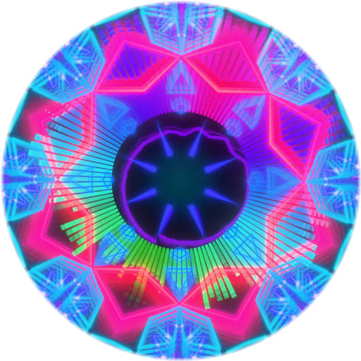
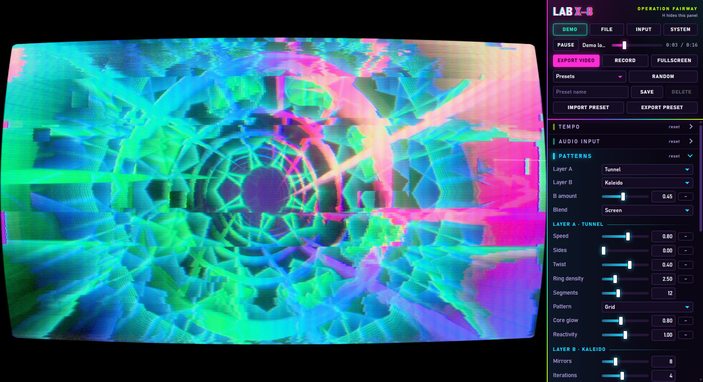
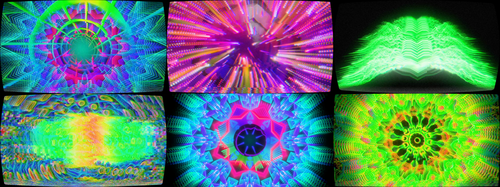

<p align="center">
  
</p>

<h1 align="center">LAB X-8</h1>

<p align="center">
  <b>Sound-reactive visual synthesis for rave, EDM and drum and bass.</b><br>
  A product of <a href="https://operationfairway.org">OPERATION FAIRWAY, LLC</a>
</p>



Lab X-8 turns music into visuals in real time. The look sits between degraded CRT video
synthesis and clean generative geometry: glowing patterns driven by the music, pushed through
video feedback, digital corruption and a worn analog monitor.

It runs in real time at 1920 x 1080 (and above), takes live audio or audio files, can use your
own image or logo on top of the visuals or inside them, and renders finished video files for VJ
sets or standalone content.



Frames from exported video. Top: the default look, Particle Storm, Phosphor Ridges.
Bottom: Signal Loss, Clean Geometry, Acid Mandala.

## Desktop application

The portable build is a folder. It needs nothing installed: no Node, no browser, no FFmpeg.

```
release/Lab X-8/Lab X-8.exe
```

Double-click it and press **Start**. Copy the whole `Lab X-8` folder to move the app to
another machine or a USB stick.

| What | Where |
| --- | --- |
| Settings and presets | `Lab X-8 Data/settings.json`, next to the program |
| Exported video | `Exports/`, next to the program, or any place you choose when exporting |
| FFmpeg | `resources/ffmpeg/`, inside the program |

When the folder is read-only, for example under Program Files, settings go to your user
profile and exports to `Videos/Lab X-8` instead.

To use another FFmpeg, put `ffmpeg.exe` next to `Lab X-8.exe`. It takes precedence over the
one inside.

### Building it

```bash
npm install
```

```bash
npm run dist
```

This builds `release/Lab X-8/`. Rebuilding updates the program and keeps the settings and
exports stored in that folder. Close the app before rebuilding.

| Command | Result |
| --- | --- |
| `npm run dist` | The folder |
| `npm run dist -- --zip` | The folder, and `Lab-X-8-portable.zip` for handing on |
| `npm run dist -- --exe` | The folder, and `Lab-X-8-portable.exe`, a single-file build |

The single file is slow to start because it unpacks itself on every launch. Use the folder.

FFmpeg is copied from this machine into the build. It is a separate program under its own
licence, the GPL, which is included next to it. Keep that licence with FFmpeg if you pass the
app on to others.

### What the desktop application does differently

- **System audio** is captured directly. No dialog asks which screen to share.
- **Rendering does not slow down** when the window is covered or not focused, and exports run
  at full speed even when it is minimized.
- **Exports are written straight to disk**, to the exports folder or a place you pick.

## Running it in a browser

For development, or where the desktop application is not wanted.

- Node.js 20 or newer
- Chrome or Edge with hardware acceleration enabled
- Optional: FFmpeg on the `PATH`, for ProRes, HAP and the other FFmpeg codecs

```bash
npm run dev
```

Open http://localhost:5173 and click **Start**. The built-in demo loop plays so there is
something to look at straight away.

## Using it

### Audio

| Button | Source |
| --- | --- |
| Demo | Built-in drum and bass loop, rendered at the chosen BPM |
| File | Any audio file the browser can decode (WAV, MP3, FLAC, OGG, M4A). Drag and drop works too |
| Input | Microphone or line input |
| System | Whatever the computer is playing. In a browser, a dialog asks which screen or tab to share. Tick "Share audio" |

Live inputs are analysed but never played back, so a microphone cannot feed back.

### Tempo

The tempo is chosen, not detected. Set **BPM** (60 to 220) to the tempo of your track.
It drives the beat and bar clocks that patterns and modulation can follow.

- With a file, beats count from the start of the file. **Beat offset** shifts the grid if your
  track does not start on the first beat.
- **Tap tempo** (or `T`): tap along, starting on the first beat of a bar. One tap sets the bar
  start. Several taps also set the BPM.
- Kick, snare and hat hits are detected from the audio and are independent of the tempo.

### Patterns

Two pattern layers, A and B, each one of seven generators:

| Key | Generator | What it draws |
| --- | --- | --- |
| 1 | Tunnel | Fly-through whose walls carry the recent spectrum, with a ring of light on every beat |
| 2 | Kaleido | Mirrored wedges around an iterated fold, as glowing outlines |
| 3 | Plasma | Domain-warped noise, the organic colour wash |
| 4 | Particles | Point field rushing past the camera, each point tuned to a frequency |
| 5 | Spectrum | The classic analyser: radial bars, echo rings or mirrored bars |
| 6 | Scope | Oscilloscope trace, circular scope, or spectrum ridgelines |
| 7 | Moire | Interference of circular waves |

Digits select layer A. Shift plus a digit selects layer B.

### Stages

After the patterns, the picture passes through these stages, in this order:

| Stage | Purpose |
| --- | --- |
| Image | Your picture, when it is mixed into the scene. On top, it comes after Bloom instead |
| Feedback | Video feedback: trails, echoes, analog persistence |
| Glitch | Digital corruption that fires with the transients |
| Colour | Palette, exposure, contrast, saturation, hue, posterize |
| Bloom | Glow around bright areas |
| CRT | Sync errors, colour bleed, scanlines, phosphor mask, tube curvature |
| Output | Tone mapping and final encoding |

Setting a stage's main amount to zero bypasses it completely. Each section of the control
panel has its own colour, so you can tell at a glance which stage a slider belongs to.

### Picture size

**Resolution** in the Output section sets the size of the picture, for the live output and as
the starting point of an export. Besides 16:9 from 720p to 2160p there are square 1:1,
portrait 4:5, vertical 9:16, classic 4:3 and ultrawide 21:9 sizes. **Custom size** takes any
width and height from 16 to 7680 pixels, for LED walls, projection or a social media format.
Odd numbers are rounded up to even, which video encoders need. Patterns and effects follow the
shape of the picture, and the cost follows its pixel count: 1080 x 1080 costs about half as
much as 1080p.

HAP needs a width and height divisible by 4. The export dialog says so when a size does not
fit, as it does for 1080 x 1350.

### Image

**Load image** in the Image section, or drop a file onto the picture. **Test card** generates
a broadcast test pattern to try things with. PNG transparency is kept, so a logo sits cleanly
on the visuals.

**Placement** decides where the picture enters the chain:

| Placement | Result |
| --- | --- |
| On top | Laid over the finished visuals, sharp and in its own colours. Only the CRT screen acts on it, so it still sits on the same monitor as everything else |
| In the scene | Mixed in before the effects. Trails, glitches, grading and bloom act on it, and it melts into the visuals |

What makes the picture part of the show rather than a sticker on it:

- It pulses and flashes with the kick: Scale and Brightness are driven by the kick by default.
- **Neon glow** runs a rim of light around it in the colours of the palette.
- **Shadow** darkens the visuals around it, so even thin lettering reads over a busy picture.
- **Glitch** tears bands of it sideways on drum hits. **RGB split**, **Warp**, **Ripple** and
  **Bend by visuals** shake and bend it with the music.

**Position X** and **Position Y** move it, for example into a corner as a watermark. For a logo
on a black background choose the blend **Screen**, for one on white **Multiply**.

A preset you save stores the image settings with the look. The built-in looks store none, so
switching between them leaves the picture where you put it.

The image can also be mapped onto the tunnel walls: choose the pattern "Image walls" in the
Tunnel generator.

### Letting the audio drive a parameter

Every slider of the look has a small button at its right end. Click it, choose a source and a
depth. Modulated parameters turn acid green, and the green marker on the slider shows the
live value.

Sources: level, six frequency bands, kick, snare, hat, any onset, beat pulse, beat ramp,
bar pulse, bar ramp, and two free-running LFOs.

The sensitivity of each frequency band is set in **Audio input**.

### Presets

Seven built-in looks, plus your own. **Random** (or `R`) rolls a new look. **Export preset**
and **Import preset** move looks between machines as JSON files. Presets store the look only.
Tempo, input sensitivity and display settings are left alone. A preset without image settings,
such as a built-in look, leaves the image alone too.

### Cycling through looks

**Cycle** changes looks by itself during a track, on bar lines, so a long track keeps moving.

| Setting | Effect |
| --- | --- |
| Looks | All presets, the built-in looks, only your own presets, or random looks |
| Order | In order, or shuffled. Shuffled plays every look once before any comes back, and never the same look twice in a row |
| Every | 4, 8, 16, 32 or 64 bars |
| Transition | Length of the change in bars, ending on the bar line. 0 cuts on the beat |
| Style | **Crossfade**. **Screen**: the light of the two looks adds up. **Brightest first**: the new look breaks through where it shines most. **Glitch blocks**: the picture flips block by block |

During a transition both looks are drawn in full, each with its own trails, and the two
finished pictures are blended. Nothing jumps, and the look fading out keeps moving with the
music until it is gone.

**Random looks** rolls a new look at every change, the way the **Random** button does. What
Random leaves alone stays as you set it: the image and output settings, and settings such as
exposure, hue, posterize and the custom colours. **Roll new looks** gives a different series.
If a random look is worth keeping, press **Save** while it is on screen.

The cycle counts bars from the start of the track, so an export changes looks at exactly the
same moments as the preview, random looks included. Set the BPM first. **Reshuffle** deals a
new shuffled order, and `C` turns the cycle on and off.

### Keys

| Key | Action |
| --- | --- |
| Space | Play or pause |
| H | Show or hide the control panel |
| F | Fullscreen |
| S | Show or hide the statistics |
| T | Tap tempo |
| C | Cycle looks on or off |
| R | Random look |
| E | Export video |
| Left, Right | Previous or next preset |
| 1 to 7 | Generator for layer A. With Shift, for layer B |

## Exporting video

**Export video** renders a track to a file, frame by frame. It does not run in real time:
every frame is computed from the exact audio it belongs to, so an export never drops a frame,
whatever the resolution or the complexity of the look.

| Encoder | Codecs | Notes |
| --- | --- | --- |
| Built in | H.264, HEVC, AV1 in MP4. VP9 in WebM | Hardware accelerated, fastest. 4:2:0 colour |
| FFmpeg | H.264 (NVENC or x264), HEVC (NVENC), ProRes 422 HQ, ProRes 4444, HAP, HAP Q | HAP and ProRes are what VJ software prefers |

Destinations in the desktop application:

- **Exports folder** writes into `Exports/`.
- **Choose a file** opens the save dialog.

Destinations in a browser:

- **Choose a file** streams to a file you pick.
- **Project folder** streams into `exports/`.
- **Download when finished** builds the file in memory first. Use it for short clips only.

In a browser, the FFmpeg encoder and the project folder need the app to be served by
`npm run dev` or `npm run preview`, because that server hosts the link to FFmpeg and to disk.

**Record** captures the live output in real time instead. Use it for performances driven by
a live input, where there is no track to render.

## Performance

Measured on an NVIDIA RTX 3080 with every stage active and two pattern layers:

| Resolution | GPU time per frame | Share of a 60 fps frame |
| --- | --- | --- |
| 1920 x 1080 | 0.6 to 1.1 ms | 4 to 7 % |
| 2560 x 1440 | 1.0 to 1.3 ms | 6 to 8 % |
| 3840 x 2160 | 2.0 to 2.7 ms | 12 to 16 % |

While the cycle fades between two looks, both are drawn, which doubles the GPU time for the
length of the transition.

On slower graphics hardware, lower **Render scale** in the Output section. The scene is then
rendered smaller and upscaled, while scanlines and the phosphor mask stay pixel sharp.

Export speed in the desktop application, for 1080p at 60 frames per second:

| Encoder | Frames per second | Compared with real time |
| --- | --- | --- |
| Built-in H.264 | 134 | 2.2 times faster |
| Built-in H.264 at 2560 x 1440 | 88 | 1.5 times faster |
| FFmpeg H.264 (NVENC) | 56 | about real time |
| FFmpeg HAP | 50 | slightly slower |
| FFmpeg ProRes 422 HQ | 23 | 2.6 times slower |

## Scripts

| Command | Purpose |
| --- | --- |
| `npm run dist` | Builds the portable desktop application into `release/Lab X-8/` |
| `npm run desktop` | Builds and starts the desktop application without packaging it |
| `npm run desktop:dev` | Desktop application with shader hot reload |
| `npm run dev` | Browser development server with shader hot reload |
| `npm run build` | Type check and production build of the web app into `dist/` |
| `npm run preview` | Serves the production build in a browser |
| `npm test` | Unit tests |
| `npm run typecheck` | Type check only |
| `npm run icon` | Redraws the app icon from `tools/make-icon.mjs` |

## Adding an effect

A generator or stage is one GLSL file plus a description of its parameters. The control panel,
presets, modulation and uniform binding follow from that description. See
[docs/ARCHITECTURE.md](docs/ARCHITECTURE.md#adding-a-generator) for a walk-through.

## Project layout

```
src/
  app/        composition root, frame loop, clocks
  audio/      Web Audio graph, demo loop, analysis (FFT, bands, onsets, beat clock)
  effects/    generators and stages: GLSL plus parameter descriptions
  gfx/        WebGL2 renderer, render targets, shader library
  params/     parameter store, modulation, palettes, presets
  export/     offline renderer, encoders, live recorder
  ui/         control panel, header, export dialog, statistics, styles
  platform/   what the app may ask of the desktop shell
  brand.ts    product name, publisher and website, in one place
electron/     desktop shell: window, private server, settings file, permissions
bridge/       link to FFmpeg and to disk, shared by the shell and the dev server
tools/        build, packaging and icon scripts
tests/        unit tests
docs/         architecture
```

## Known limits

- The desktop build is for Windows. In a browser, only Chrome and Edge are supported.
- A minimized window is not drawn. Live rendering continues when the window is merely covered
  or out of focus, and exports are unaffected either way.
- The app is not code signed. Windows may ask for confirmation the first time a copy that
  came from another machine is started.
- Two exports of the same project are visually identical, but not always bit-identical.
  Graphics drivers re-optimise shaders in the background, which can change isolated pixels by
  one step out of 255.
- Offline export needs a track. A live input can only be recorded in real time.

## About

Lab X-8 is developed and published by **OPERATION FAIRWAY, LLC**, a record label registered
in the State of Alaska. [operationfairway.org](https://operationfairway.org)

Copyright © 2026 OPERATION FAIRWAY, LLC. All rights reserved.

The desktop build includes third-party software under its own licences: Electron and
Chromium (licence files in the program folder), FFmpeg (GPL, in `resources/ffmpeg/`) and
Mediabunny (MPL-2.0, https://github.com/Vanilagy/mediabunny).
